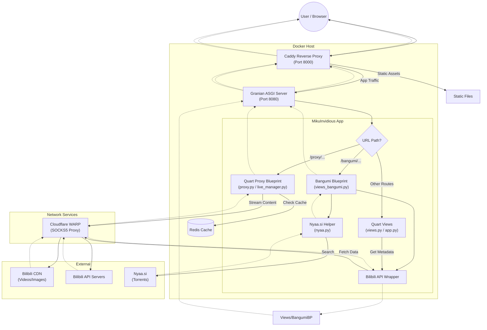

# MikuInvidious Project Overview

MikuInvidious is a free and open-source frontend for Bilibili, inspired by Invidious. It aims to provide a lightweight, privacy-focused experience for browsing Bilibili content without the need for heavy official clients or extensive tracking.

## Core Technologies

- **Language:** Python 3.14+
- **Web Framework:** [Quart](https://pgjones.gitlab.io/quart/) (Modern asynchronous web framework)
- **Web Server:** [Caddy](https://caddyserver.com/) (Reverse proxy) + [Granian](https://github.com/emmett-framework/granian) (Rust-powered ASGI server)
- **Database/Cache:** [Redis](https://redis.io/) (required for caching video URLs, session management, and credential storage)
- **API Wrapper:** Local `python/api/` module (replaces the archived [bilibili-api-python](https://github.com/nemo2011/bilibili-api); migration completed Sep 2 2026)
- **Video Player:** `dash.js` (VOD DASH), `hls.js` + `mpegts.js` (live streams, FLV), native MP4 (progressive fallback)
- **Templating:** Jinja2 (with theme support)

## System Architecture

### High-Level Design

The system uses **Caddy** as a reverse proxy and static file server, which forwards application requests to **Granian** running the **Quart** (ASGI) application. All logic and proxying are handled within the Quart application using asynchronous I/O.

- **Reverse Proxy (Caddy):** Handles incoming traffic (port 8000), serves static assets, and proxies requests to the ASGI server.
- **ASGI Server (Granian):** Runs the Quart application (port 8080 in Docker).
- **App Logic (`app.py`):** Main entry point for the application, registering blueprints and routes.
- **Media Proxy (`proxy.py`, `dash_proxy.py`):** Streams video/images via raw-socket `CdnConnection` through the WARP SOCKS5 tunnel. Uses `ProxyResponse` + `ClosingIterator` to prevent file descriptor leaks.
- **Network Transport:** Integrates with **Cloudflare WARP** (via SOCKS5) to route traffic to Bilibili.

### Request Flowchart



### Component Breakdown

- **Application Logic:**
  - `app.py`: Initializes the Quart app, error handlers, and registers blueprints.
  - `views.py`: Main routing logic for home, search, video, space, and author views.
  - `views_bangumi.py`: Blueprint for Bangumi (Anime/Show) indexing and playback.
  - `shared.py`: Centralized configuration, `httpx` client management, Redis connection, and theming utilities.
  - `proxy.py`: Progressive (`/proxy/video/`) + image proxying via `CdnConnection`.
  - `dash_proxy.py`: Canonical DASH stack — playurl fetch, MPD generation, Range-capable track proxy, muxed download.
  - `live_manager.py`: Manages persistent live stream connections, chunk buffering, and heartbeat (Type 18) injection.
  - `danmaku.py`: Fetches and converts Bilibili danmaku.
  - `nyaa.py`: Scraper and helper for searching Nyaa.si torrents (integrated into Bangumi view).
  - `extra.py`: Utilities for article-to-HTML conversion and ID manipulation.
  - `transformers.py`: Data transformation logic to standardize API responses for the frontend.
  - `filters.py`: Custom Jinja2 template filters (e.g., date formatting).
  - `res.py`: Serves dynamic resources like Danmaku XML.
  - `refresher.py`: Utility to refresh Bilibili credentials.
  - `api/`: Local Bilibili API client.
    - `api/__init__.py`: Exports all public symbols (Credential, video, user, etc.)
    - `api/client.py`: HTTP client with Wbi signing, bili_ticket, auto-cookies, retry logic
    - `api/credential.py`: Credential class for auth
    - `api/exceptions.py`: ArgsException, ResponseCodeException
    - `api/video.py`: Video class (info, tags, related, pages, cid, playurl, danmaku)
    - `api/user.py`: User class (info, videos, articles)
    - `api/search.py`: search_by_type with enums
    - `api/comment.py`: get_comments with enums
    - `api/live.py`: LiveRoom, LiveDanmaku, live_area
    - `api/bangumi.py`: Bangumi class (meta, episodes, index)
    - `api/audio.py`: Audio, AudioList classes
    - `api/article.py`, `api/opus.py`: Article/Opus classes
    - `api/homepage.py`, `api/video_zone.py`: Homepage/zone feeds
    - `data/bangumi_index_params.json`: Copied from bilibili_api package

## Playback & Download Stack

DASH is the canonical VOD path; progressive `durl` remains as a fallback for uploads that have no DASH tracks.

- **DASH fetch** (`api/video.py:get_dash_playurl`, `dash_proxy.py:video_get_dash_for_qn`): wbi playurl with `fnval=4048, fourk=1, qn=120` for UGC, `/pgc/player/web/v2/playurl` fallback for PGC. Cached in Redis as `miku_dash_<vid>_<idx>` (1800s, normalized `base_url`/`backup_url` keys).
- **Manifest** (`dash_proxy.py:generate_vod_mpd`): minimal `isoff-on-demand` MPD at `/video/dash/<vid>/<idx>/manifest.mpd`; only tracks with a valid `SegmentBase.indexRange` are included. BaseURLs point at the track proxy (resolved per-request from cache, never baked in).
- **Track proxy** (`/proxy/dash/<vid>/<idx>/<type>/<qn>/<cid>`): `CdnConnection` through WARP; must forward the client `Range` and return `206` + `Content-Range`/`Content-Length`/`Accept-Ranges` (dash.js drives segmentation via sidx itself).
- **Frontend:** vendored `static/vjs/dash.min.js` (v4.7.4); `DashPlayerManager` in `static/themes/modern/js/player.js`; `api_component_player` passes `is_dash`/`dash_url` to the templates.
- **durl-only fallback** (verified Sep 11 2026): some UGC uploads (e.g. `BV1kH35z9EzG`) return a `durl`-only playurl with no `dash` node on every endpoint/param combo. `has_valid_dash_tracks()` gates the DASH path; otherwise `fetch_durl_supported_src()` resolves per-quality progressive URLs (non-wbi playurl + PGC retry, parallel) cached as `mikuinv_<vid>_<idx>_<qn>` (`+_bak` for backups), served by the native `/proxy/video/...` path.
- **Download:** `POST /download` → `302 /proxy/download/<vid>/<idx>/<qual>`. DASH videos are muxed (best video track ≤ qn 80 = 1080P anonymous cap + best standard audio, `ffmpeg -c copy -movflags +faststart`; requires `ffmpeg` in the app image). durl-only videos `302` to `/proxy/video/<vid>_<idx>_<qn><ext>?dl=1` (already muxed, no ffmpeg step).

Remaining work: PGC premium end-to-end verification against a paid episode; `video_listen`/audio migration off durl; deprecated HLS/m3u8 helper cleanup; full live end-to-end test.

## Verified Gotchas (do not regress)

- **DASH CDN requires a web User-Agent.** `.bilivideo.com` returns 403 for the Android app UA (`BiliDroid/...`); `proxy_dash` builds CDN-specific headers (web Chrome UA + `Referer`/`Origin: https://www.bilibili.com`) instead of reusing `get_common_headers()`.
- **Never send the `bili_ticket` cookie to the web API.** It triggers the anti-bot `v_voucher` precheck (empty results, e.g. broken `/search`). Only the `x-bili-ticket` *header* (CDN/DASH proxying) may carry it.
- **Space endpoints are risk-controlled from datacenter IPs** (HTTP 412 / `-352`) without the WARP proxy. `User.get_user_info` falls back to non-wbi `/x/web-interface/card`; `User.get_videos` falls back to `/x/series/recArchivesByKeywords` + `dm_img_*` fingerprint, normalized to the same `list.vlist` shape. Some non-wbi endpoints (`/x/web-interface/view`, danmaku, playurl) also 412 without WARP — IP-level anti-bot responses, not code defects.
- **Streaming routes use long timeouts** (up to 3 hours) to prevent idle drops during long-form content; image proxying uses an aggressive concurrency limit with WebP resizing.
- **Live `getInfoByRoom` requires WBI + browser TLS.** Since ~Aug 2026 Bilibili's web client calls it as `wbiSign({room_id, web_location: "444.8"})`; unsigned httpx requests get `-352` risk control. `api/live.py:get_room_info` therefore uses curl_cffi Chrome impersonation (`_wbi_get`, same pattern as `search.py`/`comment.py`). Other live endpoints (play-info v2, playUrl, danmu, area list) were unaffected; note the area-list `second/getList` and empty play-info `stream[]` from datacenter IPs are IP-level gating (need WARP), not signing issues.

## Bilibili API Reference

```
# Video (NO wbi)
GET https://api.bilibili.com/x/web-interface/view
GET https://api.bilibili.com/x/web-interface/view/detail/tag
GET https://api.bilibili.com/x/web-interface/archive/related
GET https://api.bilibili.com/x/player/pagelist
GET https://api.bilibili.com/x/player/playurl

# Video (wbi required)
GET https://api.bilibili.com/x/web-interface/wbi/view/detail

# User (wbi required)
GET https://api.bilibili.com/x/space/wbi/acc/info
GET https://api.bilibili.com/x/space/wbi/arc/search
GET https://api.bilibili.com/x/space/wbi/article

# Search (wbi required)
GET https://api.bilibili.com/x/web-interface/wbi/search/type

# Comment
GET https://api.bilibili.com/x/v2/reply/main

# Live
GET https://api.live.bilibili.com/xlive/web-room/v1/index/getInfoByRoom
GET https://api.live.bilibili.com/xlive/web-room/v2/index/getRoomPlayInfo
GET https://api.live.bilibili.com/xlive/web-room/v1/playUrl/playUrl
GET https://api.live.bilibili.com/xlive/web-interface/v1/second/getList

# Bangumi
GET https://api.bilibili.com/pgc/review/user
GET https://api.bilibili.com/pgc/web/season/section
GET https://api.bilibili.com/pgc/season/index/result
GET https://api.bilibili.com/pgc/view/web/season

# Audio
GET https://www.bilibili.com/audio/music-service-c/web/song/info
GET https://www.bilibili.com/audio/music-service-c/web/url
GET https://www.bilibili.com/audio/music-service-c/web/menu/info
GET https://www.bilibili.com/audio/music-service-c/web/song/of-menu

# Article & Opus
GET https://api.bilibili.com/x/article/viewinfo
GET https://api.bilibili.com/x/polymer/web-dynamic/v1/opus/detail

# Homepage (wbi required)
GET https://api.bilibili.com/x/web-interface/wbi/index/top/feed/rcmd

# Wbi & Auth
GET https://api.bilibili.com/x/web-interface/nav  (for wbi mixin key)
POST https://api.bilibili.com/bapis/bilibili.api.ticket.v1.Ticket/GenWebTicket  (for bili_ticket)
```

### Wbi Signing Algorithm

```
1. GET /x/web-interface/nav -> extract wbi_img.img_url + wbi_img.sub_url
2. Take filenames, concat, apply OE permutation table -> 32-char mixin_key
3. For each request: add wts=unix_ts, sort params, urlencode, append mixin_key, MD5 -> w_rid
4. Retry on -403: clear mixin_key cache, re-fetch from nav, re-sign
```

### bili_ticket Algorithm

```
1. HMAC-SHA256(key="XgwSnGZ1p", message=f"ts{int(time.time())}")
2. POST /bapis/bilibili.api.ticket.v1.Ticket/GenWebTicket with hexsign + key_id=ec02
3. Extract data.ticket from response
4. Cache for 3 days
```

## Infrastructure (Docker)

The production infrastructure consists of four orchestrated services defined in `compose.yml`:

| Service | Image | Description |
| :--- | :--- | :--- |
| **`app`** | *(Local Build)* | Granian running the Quart application. Exposes port `8080` internally. |
| **`caddy`** | `caddy:alpine` | Reverse proxy and static asset server. Exposes port `8000`. |
| **`redis`** | `redis:alpine` | Persists sessions and caches API responses. |
| **`warp`** | `caomingjun/warp` | SOCKS5 proxy (port `1080`) for routing traffic to Bilibili API/CDN. |

## Configuration

Configuration is managed via `config.toml` (recommended) or Environment Variables.

- **`[site]`**: Metadata, Robots policy, and source code link.
- **`[server]`**: Host and port settings (Default: 8888 for manual run).
- **`[credential]`**: Bilibili cookies (SESSDATA, etc.) for authenticated access.
- **`[proxy]`**: Global toggle for media proxying.
- **`[redis]`**: Redis connection details.
- **`[render]`**: Configuration for article rendering (Pandoc support).

## Development & Deployment

### Docker Deployment (Recommended)

1. **Run with Docker Compose:**

    ```bash
    docker-compose up -d --build
    ```

2. **Access:** `http://localhost:8000`

### Manual Development Setup

1. **Prerequisites:** Python 3.14+, Redis server running.
2. **Install Dependencies:**

    ```bash
    uv sync
    ```

3. **Run:**

    ```bash
    uv run python/main.py
    ```

    Access at `http://localhost:8888` (or configured port).

## Development Conventions

- **License:** GNU GPL-3.0.
- **Theming:** Templates in `templates/themes/`. Current active theme is `modern` (Tailwind CSS, light/dark, mobile-first).
- **Static Assets:** `static/` contains `hls.js`, `mpegts.js`, `dash.min.js`, and `danmaku.js`.
- **Proxying Strategy:**
  - **Images:** Always proxied with WebP optimization.
  - **Videos:** Proxied if `use_proxy=true`, via `CdnConnection` (raw socket through WARP SOCKS5).
- **B23.tv:** Short links are resolved server-side.
