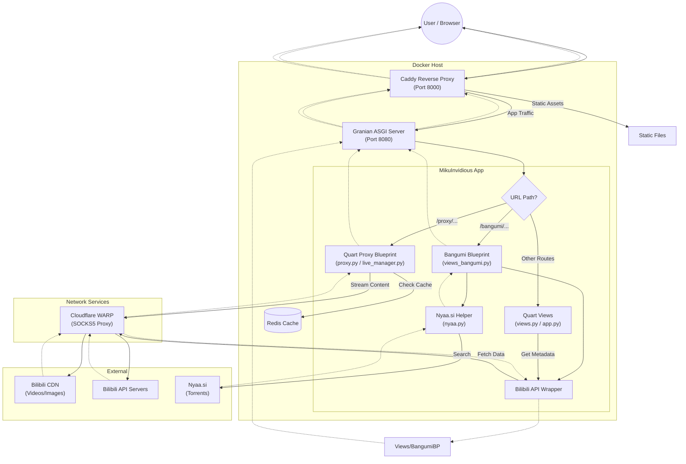

# MikuInvidious Project Overview

MikuInvidious is a free and open-source frontend for Bilibili, inspired by Invidious. It aims to provide a lightweight, privacy-focused experience for browsing Bilibili content without the need for heavy official clients or extensive tracking.

## Core Technologies

- **Language:** Python 3.14+
- **Web Framework:** [Quart](https://pgjones.gitlab.io/quart/) (Modern asynchronous web framework)
- **Web Server:** [Caddy](https://caddyserver.com/) (Reverse proxy) + [Granian](https://github.com/emmett-framework/granian) (Rust-powered ASGI server)
- **Database/Cache:** [Redis](https://redis.io/) (required for caching video URLs, session management, and credential storage)
- **API Wrapper:** Local `python/api/` module (replacing archived [bilibili-api-python](https://github.com/nemo2011/bilibili-api), see migration plan below)
- **Video Player:** `hls.js`, `mpegts.js`, and `dash.js` (for live streams, FLV, and DASH support)
- **Templating:** Jinja2 (with theme support)

## System Architecture

### High-Level Design

The system uses **Caddy** as a reverse proxy and static file server, which forwards application requests to **Granian** running the **Quart** (ASGI) application. All logic and proxying are handled within the Quart application using asynchronous I/O.

- **Reverse Proxy (Caddy):** Handles incoming traffic (port 8000), serves static assets, and proxies requests to the ASGI server.
- **ASGI Server (Granian):** Runs the Quart application (port 8080 in Docker).
- **App Logic (`app.py`):** Main entry point for the application, registering blueprints and routes.
- **Reverse Proxy (`proxy.py`):** Handles video and image streaming using Quart's async generators and `httpx`.
- **Network Transport:** Integrates with **Cloudflare WARP** (via SOCKS5) to route traffic to Bilibili.

### Request Flowchart



### Component Breakdown

- **Application Logic:**
  - `app.py`: Initializes the Quart app, error handlers, and registers blueprints.
  - `views.py`: Main routing logic for home, search, video, space, and author views.
  - `views_bangumi.py`: Blueprint for Bangumi (Anime/Show) indexing and playback.
  - `shared.py`: Centralized configuration, `httpx` client management, Redis connection, and theming utilities.
  - `proxy.py`: Quart Blueprint for media proxying. Uses a robust `ProxyResponse` class and `ClosingIterator` to prevent file descriptor leaks.
  - `live_manager.py`: Manages persistent live stream connections, chunk buffering, and heartbeat (Type 18) injection.
  - `danmaku.py`: Fetches and converts Bilibili danmaku.
  - `nyaa.py`: Scraper and helper for searching Nyaa.si torrents (integrated into Bangumi view).
  - `extra.py`: Utilities for article-to-HTML conversion and ID manipulation.
  - `transformers.py`: Data transformation logic to standardize API responses for the frontend.
  - `filters.py`: Custom Jinja2 template filters (e.g., date formatting).
  - `res.py`: Serves dynamic resources like Danmaku XML.
  - `refresher.py`: Utility to refresh Bilibili credentials.
  - `api/`: Local Bilibili API client (replacing bilibili-api-python).
    - `api/__init__.py`: Exports all public symbols (Credential, video, user, etc.)
    - `api/client.py`: HTTP client with Wbi signing, bili_ticket, auto-cookies, retry logic
    - `api/credential.py`: Credential class for auth
    - `api/exceptions.py`: ArgsException, ResponseCodeException
    - `api/video.py`: Video class (info, tags, related, pages, cid, playurl, danmaku)
    - `api/user.py`: User class (info, videos, articles)
    - `api/search.py`: search_by_type with enums
    - `api/comment.py`: get_comments with enums
    - `api/live.py`: LiveRoom, LiveDanmaku, live_area
    - `api/bangumi.py`: Bangumi class (meta, episodes, index)
    - `api/audio.py`: Audio, AudioList classes
    - `api/article.py`, `api/opus.py`: Article/Opus classes
    - `api/homepage.py`, `api/video_zone.py`: Homepage/zone feeds
    - `data/bangumi_index_params.json`: Copied from bilibili_api package

## Deep Analysis & Architectural Insights

### 1. Structural Integrity & Core Patterns

* **Quart Framework:** Chosen for its async capabilities, essential for high-concurrency streaming.
- **Unified Proxying:** Media streams (video/images) are handled via Quart blueprints, allowing for consistent application-level control, session management, and bypassing region blocks.
- **Dynamic Theming:** Templates are dynamically selected based on cookies or URL parameters. Currently focuses on the `modern` theme.

### 2. UI/UX Focus

* **Modern Theme:** Built with Tailwind CSS, supporting both Light and Dark modes. Features a responsive, mobile-first design inspired by Material Design 3.
- **Playback Experience:** Uses `hls.js`, `mpegts.js`, and `dash.js` for low-latency live streaming and high-quality DASH playback. Includes custom "Click to Play" recovery for autoplay-blocked browsers.

### 3. Codebase Health & Observations

* **Streaming Reliability:** Employs `ProxyResponse` (OO design) and `ClosingIterator` to ensure upstream `httpx` connections are closed properly, even on client disconnect.
- **Performance:** Image proxying uses an aggressive concurrency limit (50x) and CDN resizing (WebP) to ensure fast thumbnail loading.
- **Timeouts:** Uses long timeouts (up to 3 hours) for streaming routes to prevent idle drops during long-form content.

## Infrastructure (Docker)

The production infrastructure consists of four orchestrated services defined in `compose.yml`:

| Service | Image | Description |
| :--- | :--- | :--- |
| **`app`** | *(Local Build)* | Granian running the Quart application. Exposes port `8080` internally. |
| **`caddy`** | `caddy:alpine` | Reverse proxy and static asset server. Exposes port `8000`. |
| **`redis`** | `redis:alpine` | Persists sessions and caches API responses. |
| **`warp`** | `caomingjun/warp` | SOCKS5 proxy (port `1080`) for routing traffic to Bilibili API/CDN. |

## Configuration

Configuration is managed via `config.toml` (recommended) or Environment Variables.

- **`[site]`**: Metadata, Robots policy, and source code link.
- **`[server]`**: Host and port settings (Default: 8888 for manual run).
- **`[credential]`**: Bilibili cookies (SESSDATA, etc.) for authenticated access.
- **`[proxy]`**: Global toggle for media proxying.
- **`[redis]`**: Redis connection details.
- **`[render]`**: Configuration for article rendering (Pandoc support).

## Development & Deployment

### Docker Deployment (Recommended)

1. **Run with Docker Compose:**

    ```bash
    docker-compose up -d --build
    ```

2. **Access:** `http://localhost:8000`

### Manual Development Setup

1. **Prerequisites:** Python 3.14+, Redis server running.
2. **Install Dependencies:**

    ```bash
    uv sync
    ```

3. **Run:**

    ```bash
    uv run python/main.py
    ```

    Access at `http://localhost:8888` (or configured port).

## Recent Updates


## bilibili-api-python Migration Plan

**Status: COMPLETED (Sep 2 2026)**
**Goal:** Replace the abandoned `bilibili-api-python` (Nemo2011/bilibili-api, archived Jul 6 2026) with a local `python/api/` module using direct `httpx` calls.

### Migration Result

- All `bilibili-api-python` imports replaced with the local `python/api/` module across `shared.py`, `views.py`, `views_bangumi.py`, `extra.py`, `app.py`, `res.py`, `refresher.py`, `dash_proxy.py`.
- `bilibili-api-python` removed from `pyproject.toml`, `requirements.txt`, and `uv.lock`; `brotli` added as a direct dependency (needed by `api/live.py`).
- Verified working live from this host: Wbi mixin-key fetch, wbi-signed homepage feed (30 items), wbi-signed search (42 results), bili_ticket generation, buvid auto-generation.
- Note: some non-wbi endpoints (`/x/web-interface/view`, danmaku, playurl) return HTTP 412 / -352 from this datacenter IP when no WARP proxy is active; these are IP-level anti-bot responses, not migration defects, and resolve when the app routes through the WARP SOCKS5 proxy (as configured in production).

### Context

The `bilibili-api-python` library was archived after Bilibili sent a legal cease-and-desist. The last release (v17.4.2, Jun 19 2026) is frozen and will break when Bilibili changes APIs. There is **no maintained drop-in replacement**. MikuInvidious uses 20+ import sites across 8 files.

### Target: Only what this project uses

The `python/api/` module only needs to implement these specific endpoints and utilities:

#### 1. Credential & Auth (`python/api/credential.py`)
- [ ] `Credential` class: constructor (sessdata, bili_jct, buvid3, buvid4, dedeuserid, ac_time_value)
- [ ] `Credential.get_cookies()` -> dict
- [ ] `Credential.has_sessdata()`, `has_bili_jct()` -> bool
- [ ] `Credential.raise_for_no_sessdata()`, `raise_for_no_bili_jct()` -> raise `ArgsException`
- [ ] `Credential.check_refresh()`, `Credential.refresh()`, `Credential.get_cookies()` (for refresher.py)
- [ ] `sync()` wrapper (for refresher.py synchronous CLI)

#### 2. HTTP Client & Signing (`python/api/client.py`)
- [ ] `BiliClient` class: async httpx client with proxy support
- [ ] Wbi signing: `_get_mixin_key()` (fetch from nav API), `_enc_wbi()` (md5 with mixin key)
- [ ] `get_bili_ticket()` / `refresh_bili_ticket()` (HMAC-SHA256 to GenWebTicket endpoint)
- [ ] Auto cookies: buvid3/buvid4 auto-generation, bili_ticket injection
- [ ] Response processing: check HTTP status, extract `data`/`result`, check `code` field
- [ ] Wbi retry on -403 (recalculate mixin key)

#### 3. Exceptions (`python/api/exceptions.py`)
- [ ] `ArgsException` (for invalid request params)
- [ ] `ResponseCodeException(code, msg, data)` (Bilibili API error responses)

#### 4. Video Module (`python/api/video.py`)
- [ ] `Video(bvid=, credential=)` class
- [ ] `get_info()` -> GET `/x/web-interface/view` (NO wbi)
- [ ] `get_tags(page_index)` -> GET `/x/web-interface/view/detail/tag` (NO wbi)
- [ ] `get_related()` -> GET `/x/web-interface/archive/related` (NO wbi)
- [ ] `get_pages()` -> GET `/x/player/pagelist` (NO wbi)
- [ ] `get_cid(page_index)` -> extract from pages list
- [ ] `get_aid()` -> extract from info cache or bv2av
- [ ] `get_download_url(page_index, ...)` -> GET `/x/player/playurl` (NO wbi)
- [ ] `get_danmaku_xml(page_index)` -> GET danmaku XML

#### 5. User Module (`python/api/user.py`)
- [x] `User(mid=, credential=)` class (coerces uid to int; rejects `<= 0`)
- [x] `get_user_info()` -> GET `/x/space/wbi/acc/info` (wbi), falls back to non-wbi `/x/web-interface/card`
- [x] `get_videos(pn, ps)` -> GET `/x/space/wbi/arc/search` (wbi), falls back to `/x/series/recArchivesByKeywords`
- [ ] `get_articles(pn, ps)` -> GET `/x/space/wbi/article` (wbi required)

### Space browsing risk-control fallback (verified Sep 2 2026)

`/x/space/wbi/arc/search` and `/x/space/wbi/acc/info` are IP/risk-controlled from datacenter
hosts (HTTP 412 / -352 `v_voucher`) without the WARP proxy. Modeled on PipePipe
(PipePipeExtractor `BilibiliChannelExtractor`, `DeviceForger`, `utils.getDmImgParams`):

- `User.get_videos` falls back to `/x/series/recArchivesByKeywords` (`mid,keywords="",order=pubdate,pn,ps`
  + wbi + `dm_img_*` fingerprint), retrying with a fresh fingerprint on block, and normalizes
  `data.archives[]` -> `data.list.vlist` (pic http->https, `created=pubdate`, `play=stat.view`).
- `User.get_user_info` falls back to non-wbi `/x/web-interface/card?photo=true&mid=`, normalizing
  `data.card` (has `name`/`face`/`sign`/`mid`).
- This `\`3F`instant-verified from this host: `get_user_info` 4/4 complete, `get_videos` 28 items
  via the fallback even as `arc/search` returns 412/-352. Both fallbacks return the same
  data-node shape as the primary endpoints (`list.vlist` / top-level profile fields) so
  `space.html` / `space_json_feed` render without UndefinedError.

#### 6. Search Module (`python/api/search.py`)
- [ ] `search_by_type(keyword, page, search_type, order_type)` -> GET `/x/web-interface/wbi/search/type` (wbi required)
- [ ] Enums: `SearchObjectType` (VIDEO, ARTICLE, USER, LIVE), `OrderVideo`, `OrderArticle`, `OrderUser`

#### 7. Comment Module (`python/api/comment.py`)
- [ ] `get_comments(oid, type_, page, order)` -> GET comment list (needs checking if wbi)
- [ ] Enums: `CommentResourceType` (VIDEO=1, AUDIO=2), `OrderType` (TIME, LIKE)

#### 8. Live Module (`python/api/live.py`)
- [ ] `LiveRoom(room_id, credential=)` class
- [ ] `get_room_info()` -> GET `/xlive/web-room/v1/index/getInfoByRoom`
- [ ] `get_room_play_info_v2(...)` -> GET `/xlive/web-room/v2/index/getRoomPlayInfo`
- [ ] `get_room_play_url()` -> GET `/xlive/web-room/v1/playUrl/playUrl` (fallback)
- [ ] `LiveDanmaku(room_id, credential=)` -> WebSocket client for DANMU_MSG events
- [ ] `LiveProtocol`, `LiveFormat` enums
- [ ] `live_area.get_list_by_area(area_id, page)` -> GET `/xlive/web-interface/v1/second/getList`

#### 9. Bangumi Module (`python/api/bangumi.py`)
- [ ] `Bangumi(ssid=, credential=)` class
- [ ] `get_meta()` -> GET `/pgc/review/user`
- [ ] `get_episode_list()` -> GET `/pgc/web/season/section`
- [ ] Index API: GET `/pgc/season/index/result` (via `Api` class)
- [ ] PGC season: GET `/pgc/view/web/season` (via `Api` class)
- [ ] Bundle `data/bangumi_index_params.json` (copy from bilibili_api package)

#### 10. Audio Module (`python/api/audio.py`)
- [ ] `Audio(auid, credential=)` class
- [ ] `get_info()` -> GET audio song info
- [ ] `get_download_url()` -> GET audio download URL
- [ ] `AudioList(amid, credential=)` class
- [ ] `get_song_list()` -> GET audio list songs
- [ ] `get_info()` on AudioList -> GET list info

#### 11. Article & Opus Modules (`python/api/article.py`, `python/api/opus.py`)
- [ ] `Article(cvid).get_info()` -> GET `/x/article/viewinfo`
- [ ] `Opus(cvid, credential=).get_info()` -> GET `/x/polymer/web-dynamic/v1/opus/detail`

#### 12. Homepage & Zones (`python/api/homepage.py`, `python/api/video_zone.py`)
- [ ] `homepage.get_videos()` -> GET `/x/web-interface/wbi/index/top/feed/rcmd` (wbi)
- [ ] `video_zone.get_zone_new_videos(zid, pn)` -> zone new videos API

#### 13. Low-level `Api` class (`python/api/client.py`)
- [ ] `Api(url, method, verify, credential, wbi, ...)` dataclass-like
- [ ] `.update_params(**kwargs)` -> self
- [ ] `.result` property -> awaited request result
- [ ] `.request()` -> execute request with wbi signing, cookie injection, response processing

### Migration Order (by criticality)

1. **`client.py`** + **`credential.py`** + **`exceptions.py`** (foundation - everything depends on this)
2. **`video.py`** (fixes the immediate "B站返回了空的數據" error)
3. **`user.py`** + **`search.py`** (space/search pages)
4. **`comment.py`** (video comments)
5. **`live.py`** (live streaming)
6. **`bangumi.py`** (anime/show pages)
7. **`audio.py`** (music pages)
8. **`article.py`** + **`opus.py`** (reading pages)
9. **`homepage.py`** + **`video_zone.py`** (homepage/zone pages)

### Files to Modify After Migration

| File | Current `bilibili_api` imports | Action |
|---|---|---|
| `python/shared.py` | `Credential`, `request_settings`, `get_bili_ticket`, `refresh_bili_ticket` | Replace with `api.credential`, `api.client` |
| `python/views.py` | 11 modules + `Api` | Replace all `bilibili_api` imports with `api.*` |
| `python/views_bangumi.py` | `bangumi`, `Api` | Replace with `api.bangumi`, `api.client` |
| `python/extra.py` | `ArgsException`, `Api`, `video` | Replace with `api.exceptions`, `api.client`, `api.video` |
| `python/app.py` | `exceptions` (ArgsException, ResponseCodeException) | Replace with `api.exceptions` |
| `python/res.py` | `video` | Replace with `api.video` |
| `python/refresher.py` | `Credential`, `sync` | Replace with `api.credential` |
| `pyproject.toml` | `bilibili-api-python>=17.4.2` | Remove dependency |
| `requirements.txt` | `bilibili-api-python>=17.4.2` | Remove dependency |

### Key Bilibili API Endpoints Reference

```
# Video (NO wbi)
GET https://api.bilibili.com/x/web-interface/view
GET https://api.bilibili.com/x/web-interface/view/detail/tag
GET https://api.bilibili.com/x/web-interface/archive/related
GET https://api.bilibili.com/x/player/pagelist
GET https://api.bilibili.com/x/player/playurl

# Video (wbi required)
GET https://api.bilibili.com/x/web-interface/wbi/view/detail

# User (wbi required)
GET https://api.bilibili.com/x/space/wbi/acc/info
GET https://api.bilibili.com/x/space/wbi/arc/search
GET https://api.bilibili.com/x/space/wbi/article

# Search (wbi required)
GET https://api.bilibili.com/x/web-interface/wbi/search/type

# Comment
GET https://api.bilibili.com/x/v2/reply/main

# Live
GET https://api.live.bilibili.com/xlive/web-room/v1/index/getInfoByRoom
GET https://api.live.bilibili.com/xlive/web-room/v2/index/getRoomPlayInfo
GET https://api.live.bilibili.com/xlive/web-room/v1/playUrl/playUrl
GET https://api.live.bilibili.com/xlive/web-interface/v1/second/getList

# Bangumi
GET https://api.bilibili.com/pgc/review/user
GET https://api.bilibili.com/pgc/web/season/section
GET https://api.bilibili.com/pgc/season/index/result
GET https://api.bilibili.com/pgc/view/web/season

# Audio
GET https://www.bilibili.com/audio/music-service-c/web/song/info
GET https://www.bilibili.com/audio/music-service-c/web/url
GET https://www.bilibili.com/audio/music-service-c/web/menu/info
GET https://www.bilibili.com/audio/music-service-c/web/song/of-menu

# Article & Opus
GET https://api.bilibili.com/x/article/viewinfo
GET https://api.bilibili.com/x/polymer/web-dynamic/v1/opus/detail

# Homepage (wbi required)
GET https://api.bilibili.com/x/web-interface/wbi/index/top/feed/rcmd

# Wbi & Auth
GET https://api.bilibili.com/x/web-interface/nav  (for wbi mixin key)
POST https://api.bilibili.com/bapis/bilibili.api.ticket.v1.Ticket/GenWebTicket  (for bili_ticket)
```

### Wbi Signing Algorithm

```
1. GET /x/web-interface/nav -> extract wbi_img.img_url + wbi_img.sub_url
2. Take filenames, concat, apply OE permutation table -> 32-char mixin_key
3. For each request: add wts=unix_ts, sort params, urlencode, append mixin_key, MD5 -> w_rid
4. Retry on -403: clear mixin_key cache, re-fetch from nav, re-sign
```

### bili_ticket Algorithm

```
1. HMAC-SHA256(key="XgwSnGZ1p", message=f"ts{int(time.time())}")
2. POST /bapis/bilibili.api.ticket.v1.Ticket/GenWebTicket with hexsign + key_id=ec02
3. Extract data.ticket from response
4. Cache for 3 days
```

## DASH Migration Plan (durl → DASH)

**Status: BACKEND + CORE FRONTEND IMPLEMENTED (Sep 2 2026)**
- **Done:** `api/video.py:get_dash_playurl()` (wbi playurl, fnval=4048); `dash_proxy.py` rewritten as canonical DASH stack (UGC+PGC fetch, `miku_dash_<vid>_<idx>` cache, isoff-on-demand MPD gen, `/proxy/dash/...` Range-capable `CdnConnection` proxy with 206/Content-Range passthrough); `app.py` re-registers `dash_proxy_bp`; `views.py:api_component_player` switched to DASH and passes `is_dash`/`dash_url` to `player_part.html`; `extra.py:video_get_src_for_qn` marked deprecated; `video_view` precaches DASH instead of durl; dash.js vendored (`static/vjs/dash.min.js` v4.7.4) and loaded in `video.html`; `player.js` gained `DashPlayerManager` + DASH quality switching + buffer-controller skip; **muxed MP4 download** via `/proxy/download/<vid>/<idx>/<qual>` (see below).
- **Remaining:** PGC premium end-to-end verification against a paid ep; `video_listen`/audio (durl-based) migration; HLS/m3u8 deprecated-function cleanup (phase F); full live end-to-end test.

### Muxed DASH download (verified Sep 2 2026)

Bilibili removed `durl`, so downloads are muxed from DASH tracks instead (the same approach
as PipePipe, which downloads the DASH video + audio tracks separately then muxes into one MP4):

- `/download` (POST) now redirects to `/proxy/download/<vid>/<idx>/<qual>` which:
  resolves the cached `miku_dash_*` JSON, picks the best **video** track (highest `id <= 80`
  = **1080P 高清**, the anonymous cap; 4K/1080P60/Dolby are login-gated) + best standard
  **audio** track (highest in `dash.audio[]`, avoids Dolby/FLAC), downloads both full tracks
  through the WARP tunnel via `CdnConnection` (web-UA CDN headers from `_build_dash_cdn_headers`),
  remuxes with `ffmpeg -c copy -movflags +faststart`, and streams the single playable
  H.264+AAC MP4 back as an attachment.
- `_pick_download_tracks(dash_data, max_video_qn)` caps the video track at `_FREE_DOWNLOAD_MAX_QN = 80`.
- **Dockerfile** added `apk add ffmpeg` to the app image (required for the mux step).
- Verified from this host: selected 1080P (quality 80) video + 30280 audio, downloaded
  53MB+5.8MB through CdnConnection, muxed to a valid 1920x1080 H.264+AAC MP4 (~59MB, 286s).

### DASH CDN header requirement (verified Sep 2 2026)

Bilibili's `.bilivideo.com` DASH CDN returns **403 Forbidden** when the track request carries the **Android app User-Agent** (`BiliDroid/...`, the one `get_common_headers()` uses for the API layer). It only serves DASH track ranges to a **web-browser User-Agent**. Tested from this host: web Chrome UA + `Referer` + `Origin: https://www.bilibili.com` + Range → `206` with a valid fragmented-MP4 init segment; android UA with the same URL/logic → `403`. The other headers (`x-bili-ticket`, `session_id`, `x-bili-trace-id`, buvid, cookies, `app-key`, `x-bili-metadata-*`) do NOT trigger the 403 — only the UA does. `proxy_dash` therefore builds a CDN-specific header dict (web UA + Referer/Origin) instead of reusing `get_common_headers()`.

### bili_ticket cookie must NOT be sent to web API (verified Sep 2 2026)

Sending the **`bili_ticket` cookie** on Bilibili's wbi web-API requests triggers the anti-bot **`v_voucher`** precheck, returning an empty result (`data: {"v_voucher": ...}`, `numResults=None`) — e.g. breaking `/search`. Upstream `bilibili-api-python` matched this by defaulting `enable_bili_ticket=False`, so it never sent a `bili_ticket` cookie. Our `api/client.py` migration was unconditionally injecting it via `_get_anonymous_cookies()` — fixed by no longer adding `bili_ticket`/`bili_ticket_expires` to the anonymous cookie jar (the `x-bili-ticket` **header** used for CDN/DASH proxying via `shared.TicketManager` is unaffected). The buvid/b_nut/b_lsid/_uuid/buvid_fp fingerprint cookies are harmless; only the `bili_ticket` cookie triggers the gate.
**Goal:** Bilibili has finally removed the `durl` (progressive MP4/FLV) response from `playurl`. We must mark the durl stack as deprecated and build a DASH stack that proxies Bilibili's fragmented-MP4 DASH streams through the app, played in the browser with **dash.js**.

### Why durl is dead

The `playurl` endpoints (`/x/player/playurl`, `/x/player/wbi/playurl`, `/pgc/player/web/playurl`) no longer return a `durl` node. Only the `dash` node is returned (DASH fragmented MP4, separate video + audio tracks). The current `durl` code path therefore always fails/returns empty, breaking playback.

### Research: How PipePipe (reference impl) does DASH

Cloned to `/tmp/PipePipe` (with HTTPS submodules). Key files:
- `PipePipeExtractor/.../services/bilibili/extractors/BillibiliStreamExtractor.java` — extraction
- `PipePipeClient/app/src/main/java/org/schabi/newpipe/player/resolver/PlaybackResolver.java` — `createBiliBiliDashManifest()` (lines ~586-654) — manifest generation

**Findings:**

1. **Stream fetch** — requests `playurl` with `fnval=4048` (DASH+4K+8K+HDR+Dolby+AV1 bits), `qn=120`, `fnver=0`, `fourk=1`:
   - UGC: `https://api.bilibili.com/x/player/wbi/playurl` (wbi-signed, `web_location=1315873`, `dm_img*` fingerprint params, `try_look=1` when anonymous)
   - PGC/premium: `https://api.bilibili.com/pgc/player/web/v2/playurl` (NOT wbi-signed)
2. **Response shape:** `data.dash` (UGC) or `result.video_info.dash` (PGC); throws "Paid content" if `dash` is empty and the ep is paid.
3. **Track fields consumed** per representation (`baseUrl`/`base_url`, `id`, `codecs`, `bandwidth`, `width`, `height`, `frameRate`/`frame_rate`, and crucially `SegmentBase.Initialization` + `SegmentBase.indexRange`):
   - Video: `dash.video[]`
   - Audio: `dash.audio[]`, plus Dolby (`dash.dolby.audio[]`) and Hi-Res (`dash.flac.audio[]`) merged in
4. **No segment-list / no live-streaming** — each track is a *single fragmented MP4*; on-demand DASH. The `indexRange` points at the SIDX box, so the player computes segment byte-offsets itself and issues HTTP Range requests.
5. **Manifest** — PipePipe generates a minimal `isoff-on-demand` MPD per stream (*not* full multi-quality ABR; ExoPlayer picks the resolution). Exact template:
   ```xml
   <?xml version="1.0" encoding="UTF-8"?>
   <MPD xmlns="urn:mpeg:dash:schema:mpd:2011" type="static"
        profiles="urn:mpeg:dash:profile:isoff-on-demand:2011"
        minBufferTime="PT1.5S" mediaPresentationDuration="PT<dur>S">
     <Period duration="PT<dur>S">
       <AdaptationSet contentType="<video|audio>" mimeType="<video/mp4|audio/mp4>" subsegmentAlignment="true">
         <Representation id=".." bandwidth=".." codecs=".." width height frameRate>
           <BaseURL>track_url</BaseURL>
           <SegmentBase indexRange="<start>-<end>">
             <Initialization range="<start>-<end>"/>
           </SegmentBase>
         </Representation>
       </AdaptationSet>
     </Period>
   </MPD>
   ```
6. **Playback** — ExoPlayer consumes the MPD + track URL directly; the sidx drives Range requests into the same file. For multi-track ABR, each Representation/AdaptationSet can carry its own BaseURL.

### Architecture for MikuInvidious DASH stack

Goal: **dash.js in the browser + on-demand MPD generated server-side + Range-capable byte proxy** that re-uses the existing WARP/CDN infra (`CdnConnection`, cookie/ticket headers, `is_safe_proxy_url`).

```
Browser (dash.js)
   │  GET /video/dash/<vid>/<idx>/manifest.mpd      → generated MPD (isoff-on-demand)
   │  GET /proxy/dash/<vid>/<idx>/<video|audio>/<qn>/<cid>  → Range-capable byte proxy
   ▼
Quart
   ├─ video_get_dash_for_qn()  (watch/playurl?fnval=4048 → dash node + support_formats)
   │    ├─ UGC:  api.bilibili.com/x/player/wbi/playurl   (wbi)
   │    ├─ PGC:  /pgc/player/web/v2/playurl             (results.video_info.dash)
   │    └─  cached redis: miku_dash_<vid>_<idx>  (1800s)
   ├─ generate_vod_mpd()       (isoff-on-demand, SegmentBase indexRange + Initialization)
   │    └─ BaseURL = /proxy/dash/<vid>/<idx>/<type>/<qn>/<cid>
   └─ /proxy/dash/...          (CdnConnection through WARP)
        ├─ looks up track URL from cached dash JSON
        ├─ forwards Range / If-Range / X-Playback-Session-Id + bili auth headers
        └─ returns 200/206, passes Content-Range/Content-Length/Accept-Ranges/ETag
```

**Critical requirements (deltas from the old deprecated `dash_proxy.py`):**
- The old `proxy_dash` used `httpx` streaming and **stripped** `Content-Range`/`Content-Length` — that breaks on-demand DASH. The proxy **must** emit `206 Partial Content` + `Content-Range` + `Content-Length` + `Accept-Ranges`, and forward the client's `Range` upstream. Use `CdnConnection` (raw SOCKS5 socket through WARP, as `proxy.py` now does) rather than httpx.
- Track URLs must be resolved *per-request* from the cached dash JSON (`miku_dash_<vid>_<idx>`), not baked into the MPD (they expire / rotate).
- Must normalize both `baseUrl`/`base_url` and `backupUrl`/`backup_url` key spellings returned by Bilibili.
- Handle PGC premium shape: `result.video_info.dash` (new) vs `result.dash` (legacy) vs `data.dash` (UGC).

### Task Checklist

#### A. durl stack → deprecate
- [x] Add `DeprecationWarning` / docstring notes to `extra.video_get_src_for_qn` and the `durl` branches in `views.py`.
- [ ] Keep `/proxy/video/` progressive route working (still used for B23 redirects/downloads + FLV live) but remove the `mikuinv_..._bak` fallback crawl for VOD in `proxy.py` (no durl upstream anymore).
- [x] Convert `api_component_player.get_durl_playurls()` → dash-based `supported_src` (quality list derived from `support_formats`, no per-qn url caching).

#### B. Canonical DASH fetch (api layer)
- [x] Add `Video.get_dash_playurl(page_index=None, cid=None, qn=120)` to `python/api/video.py` returning `data` node (wbi playurl, fnval=4048, fourk=1, dm_img params — model on PipePipe + existing `get_download_url`).
- [x] Promote `dash_proxy.video_get_dash_for_qn` from deprecated → canonical: UGC + PGC fallback, returning `{"dash":..., "support_formats":...}` shape; store normalized `base_url`/`backup_url` keys.
- [x] Redis cache key `miku_dash_<vid>_<idx>` (orjson, 1800s) + helper to read/write.

#### C. MPD manifest endpoint
- [x] Rewrite `generate_vod_mpd` (currently deprecated in `dash_proxy.py`, hovered at `proxy_dash`): isoff-on-demand profile, `<AdaptationSet>` per media type, `<SegmentBase indexRange=... indexRangeExact="true">` + `<Initialization range=.../>`, BaseURL → `/proxy/dash/...`, only for tracks with valid SegmentBase.
- [x] Route `GET /video/dash/<vid>/<idx>/manifest.mpd` (re-enable, no longer deprecated), respecting `use_proxy=false`.

#### D. Range-capable track proxy
- [x] Add `@proxy_bp.route("/proxy/dash/<vid>/<int:idx>/<media_type>/<int:qn>/<int:cid>")` (or `dash_proxy.py` re-registered) using `CdnConnection`:
  - resolve track URL from cached dash JSON (`miku_dash_<vid>_<idx>`),
  - validate via `is_safe_proxy_url`,
  - build bili headers (cookie jar, x-bili-ticket, session_id, trace-id, buvid), forward `Range`/`If-Range`/`X-Playback-Session-Id`,
  - pass through status (200/206), `Content-Type`, `Content-Length`, `Content-Range`, `Accept-Ranges`, `ETag`, `Last-Modified`, `Cache-Control`.
- [x] Optional: HEAD support for dash.js `Range`/index probing.

#### E. Frontend: dash.js
- [x] Vendor `dash.min.js` into `static/vjs/` (from `npm`/CDN `dashjs`, pinned version), update CSP/media-src/worker-src if needed.
- [x] `templates/macros.html` + `components/player_part.html`: when DASH is available, set `window.is_dash` + MPD URL (`/video/dash/<vid>/<idx>/manifest.mpd`), keep mpegts.js FLV / native MP4 as fallbacks.
- [x] `static/themes/modern/js/player.js`: add `DashPlayerManager` (mirror `VodStreamManager`): `dashjs.MediaPlayer().create()`, `initialize(video, mpdUrl, false)`, `updateSettings({streaming:{buffer:{fastSwitchEnabled:true}}})`, reconnect/recovery on `ERROR` event; wire quality menu via `setQualityFor('video', idx)` / ABR auto.
- [x] `api_component_player` returns `is_dash` + `dash_url` to the template so the macro can render the right player path.
- [ ] Keep download links (`/download` → `/proxy/video/...`) working via best DASH video track merged with audio? *(Out of scope for v1 — keep current behavior, note limitation.)*

#### F. Cleanup / docs
- [ ] Remove duplicate deprecated functions (`generate_vod_master_m3u8`, `video_master_m3u8_view`, `video_media_m3u8_view`, `generate_vod_media_m3u8`) or gate behind durl/DASH deprecation.
- [x] Refresh `app.py` blueprint registration (currently commented out `dash_proxy_bp`).
- [ ] Update this AGENTS.md with implementation status once code lands.

### Files to Modify After Migration

| File | Current role | Action |
|---|---|---|
| `python/api/video.py` | `get_download_url` (durl-based) | Add `get_dash_playurl()`, keep old method for compat |
| `python/dash_proxy.py` | Deprecated DASH code | Rewrite as canonical DASH stack (MPD gen + proxy + fetch) |
| `python/proxy.py` | `/proxy/video/` durl streaming | Remove durl-only `_bak`/lower-quality crawl; add Range passthrough helpers if reused |
| `python/extra.py` | `video_get_src_for_qn` (durl) | Mark deprecated; add `video_get_dash_for_qn` canonical or delegate to api.video |
| `python/views.py` | `api_component_player` durl precache | Switch to dash fetch; pass `is_dash`/`dash_url` to templates |
| `python/app.py` | blueprints | Re-register dash blueprint |
| `templates/macros.html` | video_player macro | Render dash.js path when available |
| `templates/themes/modern/components/player_part.html` | player fragment | Pass dash flags |
| `static/themes/modern/js/player.js` | mpegts/hls/native VOD | Add `DashPlayerManager` |
| `static/vjs/` | hls.js/mpegts.js | Add `dash.min.js` |
| `good.md`/README | docs | Update player stack list |

## Development Conventions

- **License:** GNU GPL-3.0.
- **Theming:** Templates in `templates/themes/`. Current active theme is `modern`.
- **Static Assets:** `static/` contains `hls.js`, `mpegts.js`, and `danmaku.js`.
- **Proxying Strategy:**
  - **Images:** Always proxied with WebP optimization.
  - **Videos:** Proxied if `use_proxy=true`. Uses `httpx` with `follow_redirects=True`.
- **B23.tv:** Short links are resolved server-side.
