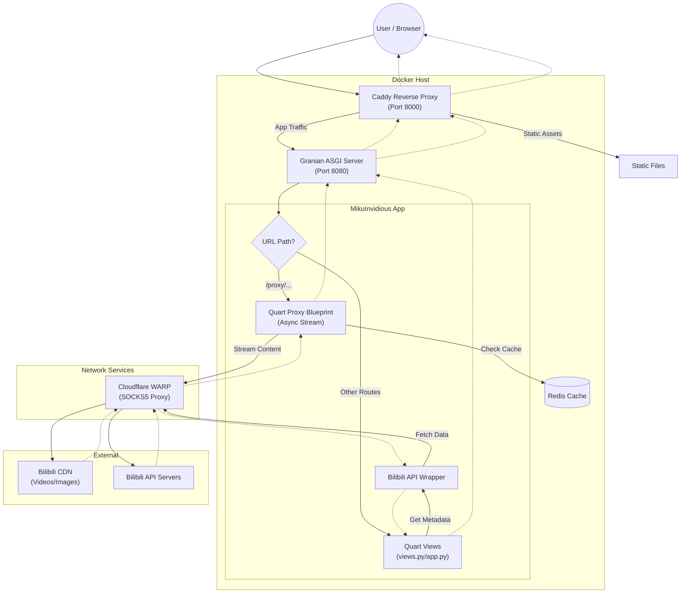

# MikuInvidious Project Overview

MikuInvidious is a free and open-source frontend for Bilibili, inspired by Invidious. It aims to provide a lightweight, privacy-focused experience for browsing Bilibili content without the need for heavy official clients or extensive tracking.

## Core Technologies

- **Language:** Python 3
- **Web Framework:** [Quart](https://pgjones.gitlab.io/quart/) (Modern asynchronous web framework)
- **Web Server:** [Caddy](https://caddyserver.com/) (Reverse proxy) + [Granian](https://github.com/emmett-framework/granian) (Rust-powered ASGI server)
- **Database/Cache:** [Redis](https://redis.io/) (required for caching video URLs, session management, and credential storage)
- **API Wrapper:** [bilibili-api-python](https://github.com/nemo2011/bilibili-api)
- **Video Player:** `hls.js`, `mpegts.js`, and `dash.js` (for live streams, FLV, and DASH support)
- **Templating:** Jinja2 (with theme support)

## System Architecture

### High-Level Design

The system uses **Caddy** as a reverse proxy and static file server, which forwards application requests to **Granian** running the **Quart** (ASGI) application. All logic and proxying are handled within the Quart application using asynchronous I/O.

- **Reverse Proxy (Caddy):** Handles incoming traffic (port 8000), serves static assets, and proxies requests to the ASGI server.
- **ASGI Server (Granian):** Runs the Quart application (port 8080 in Docker).
- **App Logic (`app.py`):** Main entry point for the application, registering blueprints and routes.
- **Reverse Proxy (`proxy.py`):** Handles video and image streaming using Quart's async generators and `httpx`.
- **Network Transport:** Integrates with **Cloudflare WARP** (via SOCKS5) to route traffic to Bilibili.

### Request Flowchart



### Component Breakdown

- **Application Logic:**
  - `app.py`: Initializes the Quart app, error handlers, and registers blueprints.
  - `views.py`: Main routing logic for home, search, video, space, and author views.
  - `shared.py`: Centralized configuration, `httpx` client management, Redis connection, and theming utilities.
  - `proxy.py`: Quart Blueprint for media proxying. Uses a robust `ProxyResponse` class and `ClosingIterator` to prevent file descriptor leaks.
  - `live_manager.py`: Manages persistent live stream connections, chunk buffering, and heartbeat (Type 18) injection.
  - `danmaku.py`: Fetches and converts Bilibili danmaku.
  - `extra.py`: Utilities for article-to-HTML conversion and ID manipulation.
  - `transformers.py`: Data transformation logic to standardize API responses for the frontend.
  - `filters.py`: Custom Jinja2 template filters (e.g., date formatting).
  - `res.py`: Serves dynamic resources like Danmaku XML.
  - `refresher.py`: Utility to refresh Bilibili credentials.

## Deep Analysis & Architectural Insights

### 1. Structural Integrity & Core Patterns

* **Quart Framework:** Chosen for its async capabilities, essential for high-concurrency streaming.
- **Unified Proxying:** Media streams (video/images) are handled via Quart blueprints, allowing for consistent application-level control, session management, and bypassing region blocks.
- **Dynamic Theming:** Templates are dynamically selected based on cookies or URL parameters. Currently focuses on the `modern` theme.

### 2. UI/UX Focus

* **Modern Theme:** Built with Tailwind CSS, supporting both Light and Dark modes. Features a responsive, mobile-first design inspired by Material Design 3.
- **Playback Experience:** Uses `hls.js`, `mpegts.js`, and `dash.js` for low-latency live streaming and high-quality DASH playback. Includes custom "Click to Play" recovery for autoplay-blocked browsers.

### 3. Codebase Health & Observations

* **Streaming Reliability:** Employs `ProxyResponse` (OO design) and `ClosingIterator` to ensure upstream `httpx` connections are closed properly, even on client disconnect.
- **Performance:** Image proxying uses an aggressive concurrency limit (50x) and CDN resizing (WebP) to ensure fast thumbnail loading.
- **Timeouts:** Uses long timeouts (up to 3 hours) for streaming routes to prevent idle drops during long-form content.

## Infrastructure (Docker)

The production infrastructure consists of four orchestrated services defined in `compose.yml`:

| Service | Image | Description |
| :--- | :--- | :--- |
| **`app`** | *(Local Build)* | Granian running the Quart application. Exposes port `8080` internally. |
| **`caddy`** | `caddy:alpine` | Reverse proxy and static asset server. Exposes port `8000`. |
| **`redis`** | `redis:alpine` | Persists sessions and caches API responses. |
| **`warp`** | `caomingjun/warp` | SOCKS5 proxy (port `1080`) for routing traffic to Bilibili API/CDN. |

## Configuration

Configuration is managed via `config.toml` (recommended) or Environment Variables.

- **`[site]`**: Metadata, Robots policy, and source code link.
- **`[server]`**: Host and port settings (Default: 8888 for manual run).
- **`[credential]`**: Bilibili cookies (SESSDATA, etc.) for authenticated access.
- **`[proxy]`**: Global toggle for media proxying.
- **`[redis]`**: Redis connection details.
- **`[render]`**: Configuration for article rendering (Pandoc support).

## Development & Deployment

### Docker Deployment (Recommended)

1. **Run with Docker Compose:**

    ```bash
    docker-compose up -d --build
    ```

2. **Access:** `http://localhost:8000`

### Manual Development Setup

1. **Prerequisites:** Python 3.10+, Redis server running.
2. **Install Dependencies:**

    ```bash
    uv sync
    ```

3. **Run:**

    ```bash
    uv run python/main.py
    ```

    Access at `http://localhost:8888` (or configured port).

## Recent Updates

- **Phase 5 (Infrastructure & Modernization):**
  - **ASGI Server Migration:** Transitioned to **Granian** (Rust-powered) for improved performance and more efficient resource management.
  - **Reverse Proxy Migration:** Replaced Nginx with **Caddy**, simplifying the stack and improving static asset delivery.
  - **High-Performance Serialization:** Migrated from `json` to `orjson` for faster serialization and deserialization of API data.
  - **Event Loop Optimization:** Configured the application to use `uvloop` when available, boosting asynchronous task execution speed.
  - **Dependency Management:** Adopted `uv` for faster, more reliable dependency resolution and environment management.
  - **Documentation Expansion:** Added detailed guides for manual installation and production-ready non-Docker setups.
- **Phase 4 (Stability & Performance):**
  - **Live Stream Proxy Stabilization:** Resolved 60-second cutoff issues by tuning Granian, Quart, and Caddy timeouts (set to 3 hours).
  - **Keep-Alive Mechanism:** Implemented in-stream FLV heartbeats (Type 18 tags) in `live_manager.py` to prevent TCP connection drops.
  - **Frontend Optimization:** Migrated to `mpegts.js` for improved stability and HEVC support.
  - **Resource Management:** Fixed file descriptor leaks in `proxy.py` using `ProxyResponse` and `ClosingIterator`.
  - **Asset Loading Speed:** Implemented aggressive CDN resizing (WebP/suffixes) for all thumbnails and avatars.
  - **Aspect Ratio Fix:** Corrected video centering for non-16:9 content in fullscreen mode.
- **Phase 1-3:** Initial implementation of proxying, theming, and Bilibili API integration.

## Development Conventions

- **License:** GNU GPL-3.0.
- **Theming:** Templates in `templates/themes/`. Current active theme is `modern`.
- **Static Assets:** `static/` contains `hls.js`, `mpegts.js`, and `danmaku.js`.
- **Proxying Strategy:**
  - **Images:** Always proxied with WebP optimization.
  - **Videos:** Proxied if `use_proxy=true`. Uses `httpx` with `follow_redirects=True`.
- **B23.tv:** Short links are resolved server-side.
