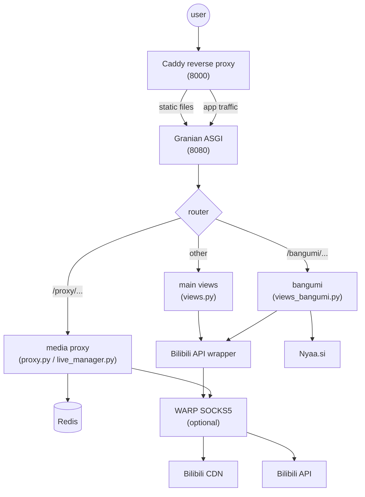

# Architecture

## Key design decisions

- **Caddy only reverse-proxies and serves static files**. Application logic lives in
  Quart, all async I/O.
- **The media proxy is always on**: `CdnConnection` dials over raw sockets, direct
  or via WARP SOCKS5. `ProxyResponse` + `ClosingIterator` guarantee no fd leaks.
- **WARP is optional**: for datacenter IPs to bypass risk control. Home broadband
  connects directly.
- **Redis is required**: sessions, playurl cache (`miku_dash_*`, 1800s), and page
  cache all depend on it.
- **3-hour streaming timeouts**: `RESPONSE_TIMEOUT` / `BODY_TIMEOUT` are fixed at
  10800 seconds so long videos play to the end.
