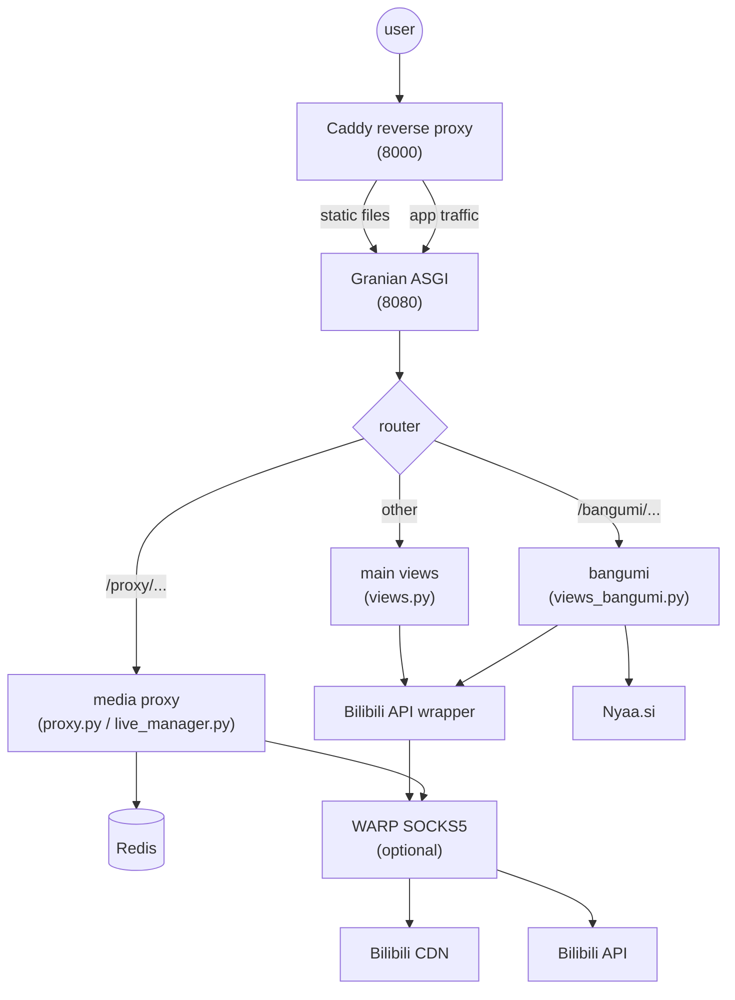

# Architecture

- **Caddy: reverse proxy + static files only.** App logic in Quart, async I/O.
- **Media proxy always on.** `CdnConnection` over raw sockets, direct or WARP
  SOCKS5. `ProxyResponse` + `ClosingIterator`: no fd leaks.
- **WARP optional.** Datacenter IPs bypassing risk control. Home broadband: direct.
- **Redis required.** Sessions, playurl cache (`miku_dash_*`, 1800 s), page cache.
- **3 h streaming timeouts.** `RESPONSE_TIMEOUT` / `BODY_TIMEOUT` fixed at
  10800 s. Long videos play to the end.
