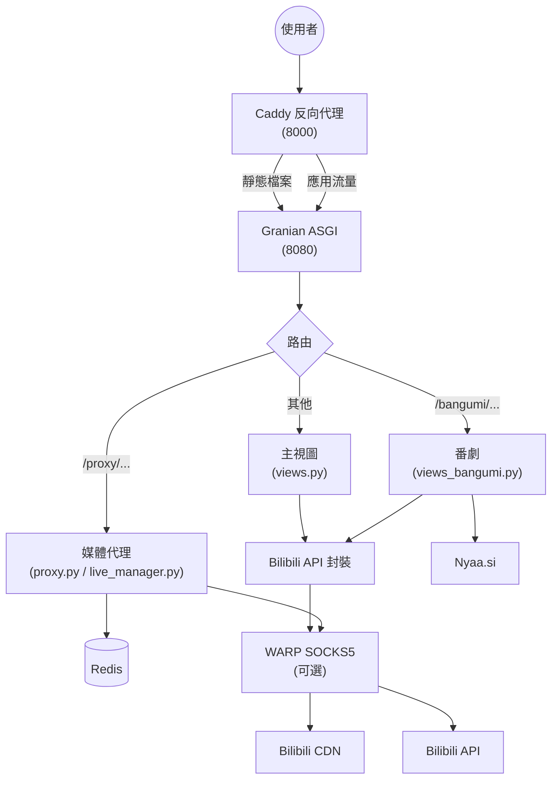

# 系統架構

## 關鍵設計決策

- **Caddy 只做反向代理和靜態檔案**，應用邏輯集中在 Quart，以非同步 I/O 處理。
- **媒體代理一律啟用**：`CdnConnection` 經由 raw socket 建立連接，直接連接或經 WARP SOCKS5 轉發；`ProxyResponse` 與 `ClosingIterator` 確保檔案描述符不洩漏。
- **WARP 是選用元件**：給資料中心 IP 繞過風險控制用，家用寬頻直接連接即可。
- **Redis 是必要元件**：工作階段、playurl 快取（`miku_dash_*`，1800 秒）、頁面快取都依賴 Redis。
- **串流逾時 3 小時**：`RESPONSE_TIMEOUT`／`BODY_TIMEOUT` 固定為 10800 秒，確保長片可以完整播完。
